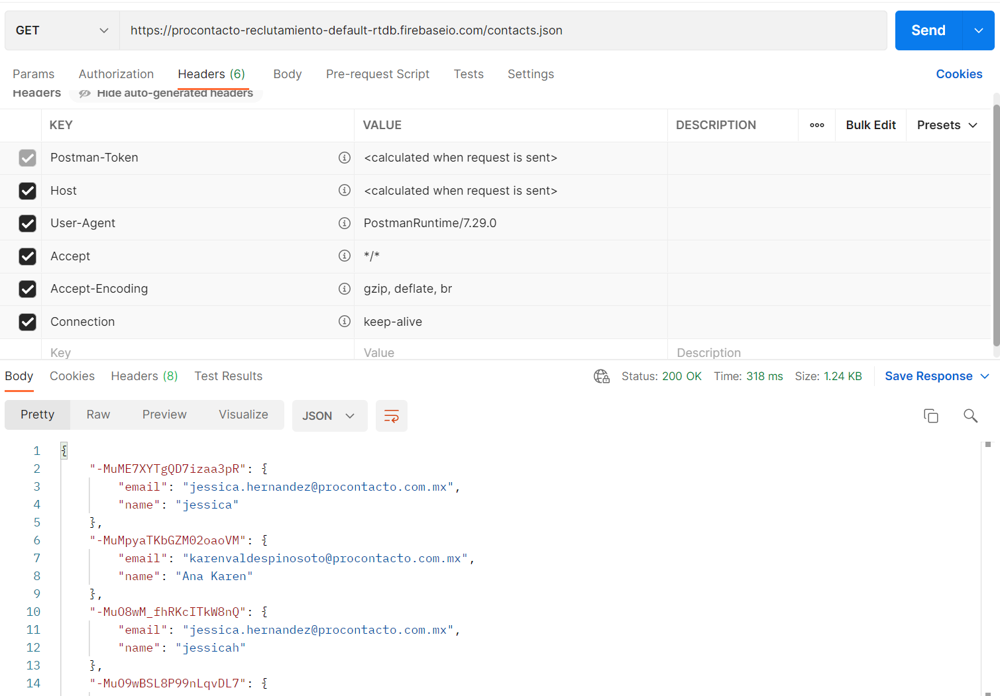
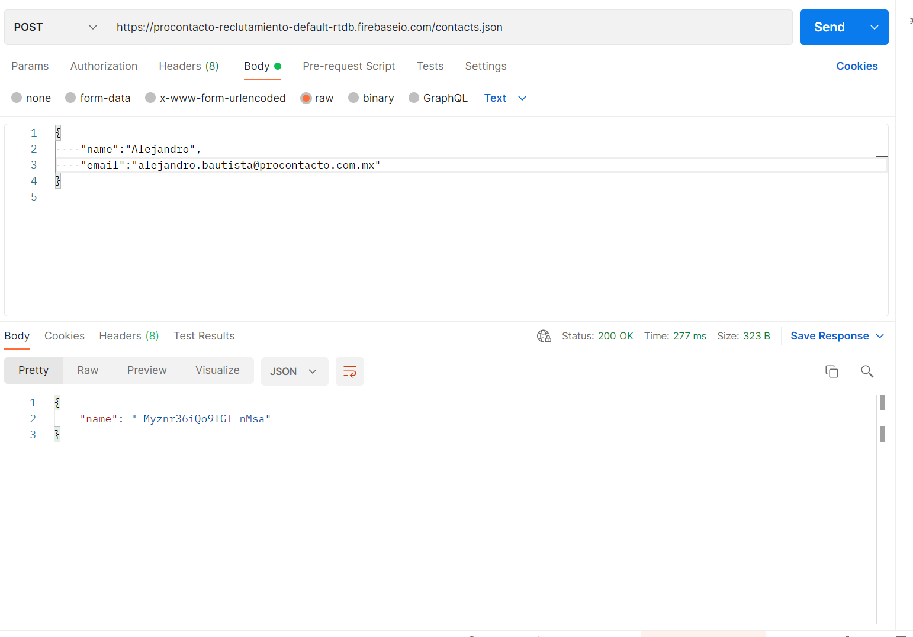
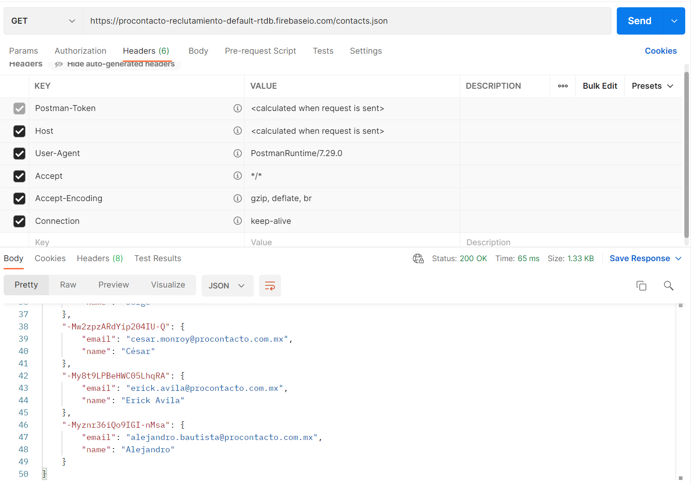
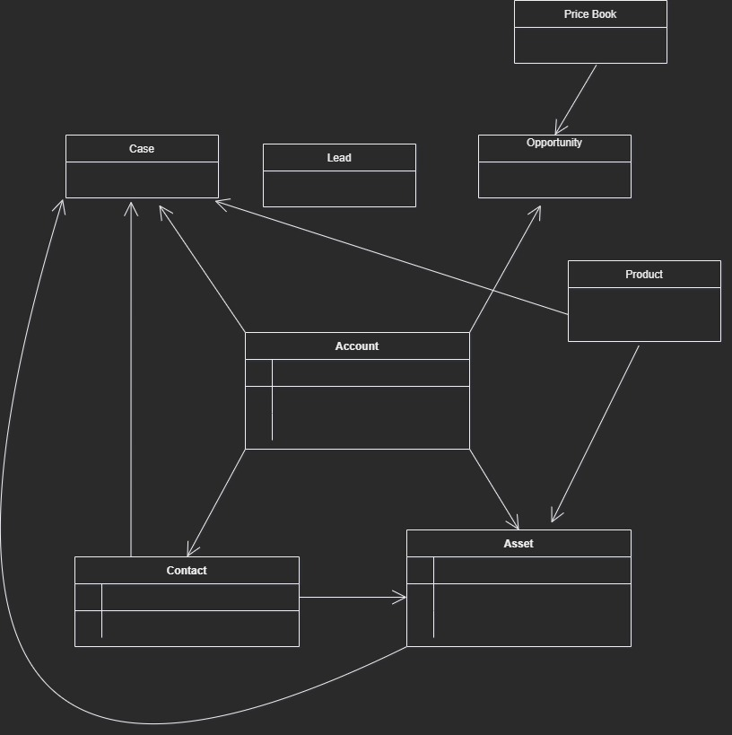

# Evaluación Practica

## Ejercicio 2

**1.	¿Qué es un servidor HTTP?**   

Es el software que utiliza el servidor para comprender direcciones URLs y los protocolos de transmisión (HTTP).

**2.	¿Qué son los verbos HTTP? Mencionar los más conocidos**
- POST
- GET
- DELETE
- HEAD
- PUT

**3.	¿Qué es un request y un response en una comunicación HTTP? ¿Qué son los headers?**

- **Request:** Es el resultado de un GET, y te regresa o recupera la información de la dirección especificada.
- **Response:** Es el mensaje respuesta que envía el servidor despues de un request (GET).
- **Header:** Es la información que se manda en un request o un response sobre los datos solicitados y el usuario.
    

**4.	¿Qué es un queryString? (En el contexto de una url)**   
El Query String en un URL es la parte donde viene la información o datos a transimitir a la aplicación web.

**5.	¿Qué es el responseCode? ¿Qué significado tiene los posibles valores devueltos?**   
Son los codigos numéricos que devuleve el servidor de acuerdo al estado de solicitud de un HTTP.    Existen valores de **errores**, **redireccionamiento** y de **respuesta**.

**6.	¿Cómo se envía la data en un Get y cómo en un POST?**   
- **GET:** a traves del Query String anexado en un URL
- **POST:** en un HTML para cambiar lo que hay en el servidor 

**7.	¿Qué verbo http utiliza el navegador cuando accedemos a una página?**   
    
    GET

**8.	Explicar brevemente qué son las estructuras de datos JSON y XML dando ejemplo de estructuras posibles.**    
Los 2 son formatos utilizados para la tranferencia de datos con funcionalidades y complejidades diferentes.

Ejemplo datos objeto empleado JSON

    {
    "empleado": 
    [ 
	
     { 
        "numID":"001", 
        "nombre": "Alejandro", 
        "apellidoP": "Bautista"
        "apellidoM": "Palacios" 
     }
    ]   
    }

Ejemplo datos empleado XML

    <?xml version="1.0" encoding="UTF-8" ?>
    <root>
        <empleado>
            <numID>001</numID>
            <nombre>Alejandro</nombre>
            <apellidoP>Bautista</apellidoP>
            <apellidoM>Palacios</apellidoM>
        </empleado>
    </root>

**9.	Explicar brevemente el estándar SOAP**      
Es el protocolo que permite la comunicación entre dos aplicaciones en diferentes lenguajes, utilizando XML.

**10.	Explicar brevemente el estándar REST Full**     
Es una interfaz basada en REST; es una API que utiliza la arquitectura REST.

**11.	¿Qué son los headers en un request? ¿Para qué se utiliza el key Content-type en un header?**    
- Los Headers en un request son los que proveen la información de la solicitud que se realizó.
- Content-type se utiliza para saber el tipo de contenido que sera regresado (Ej. texto, imagen, etc.).

## Ejercicio 3

**1.	Realizar un request GET a la URL: https://procontacto-reclutamiento-default-rtdb.firebaseio.com/contacts.json** 

**2.	Realizar un request POST a la URL anterior, y con body:
Tip: (Marcar la opción “raw” como body)**

**3.	Realizar nuevamente un request GET a la URL: https://procontacto-reclutamiento-default-rtdb.firebaseio.com/contacts.json**

**¿Qué diferencias se observan entre las llamadas el punto 1 y 3?**     
Se agregó el correo con mi nombre al momento de mandar el POST en el paso 2.

## Ejercicio 4
[Link a Modulos de Trailhead](https://trailblazer.me/id/alios)
## Ejercicio 5
Explicar que son conceptualmente, qué datos almacenan en forma estándar y cómo se relacionan el resto (algunos no se relacionan entre sí) cada uno de los siguientes objetos de Salesforce:

1.	**Lead:** 
2.	**Account:** Es el objeto en el que se almacenan las cuentas de organizaciones o individuos.
3.	**Contact:** Es el objeto contacto de una individuo.
4.	**Opportunity:** Es el objeto que representa una oportunidad de venta o un trato.
5.	**Product:** Es el objeto que contiene la información del producto
6.	**PriceBook:** Es el objeto que contiene las lista de los productos.
7.	**Quote:** Es un objeto donde se citan propuestas de productos o servicios.
8.	**Asset:** Es el objeto donde se almcenan articulos que tienen valor comercial, como productos.
9.	**Case:** Es el objeto que representa un caso de alguna situación o problema
10.	**Article:** Es el objeto de un artículo.

#### Diagrama

## Ejercicio 6
### Soluciones de Salesforce
**A.	¿Qué es Salesforce?**    
Es un CRM que brinda soluciones de ventas, comercio y servicios para relacion entre empresas y clientes.

**B.	¿Qué es Sales Cloud?**  
Es una herramienta de Salesforce enfocada a la administración y monitorización de ventas.

**C.	¿Qué es Service Cloud?**
Es una herramienta de Salesforce que facilita la parte de servicio al cliente.

**D.	¿Qué es Health Cloud?**
Es la herramienta de Salesforce que permite la monitorización de cuidados de salud con pacientes.

**E.	¿Qué es Marketing Cloud?**
Es la herramienta de Salesforce que se enfoca en la parte de marketing de la empresa.

### Funcionalidades de Salesforce
**A.	¿Qué es un RecordType?**    
Es el tipo de dato de un objeto determinado, ayuda a distinguir el usuario que tiene acceso a el.

**B.	¿Qué es un ReportType?**    
Es la plantilla para un objeto y/o un campo.

**C.	¿Qué es un Page Layout?**   
Es lo que permite la edicición y personalización de las paginas.

**D.	¿Qué es un Compact Layout?**  
Son plantillas que se usan para mostrar los campos clave cuando son los unicos requeridos.  

**E.	¿Qué es un Perfil?**    
Son el medio por el que el usuario accede a todos los datos y objetos que pueden usar en la apliccación.

**F.	¿Qué es un Rol?**   
Es la forma de manejar las jerarquias a los apartados a los que puede acceder un usuario dependiendo del nivel de su Rol.

**G.	¿Qué es un Validation Rule?**   
Son con lo que se validan los estandares al momento que un usuario ingresa datos para poder guardarlos.

**H.	¿Qué diferencia hay entre una relación Master Detail y Lookup?**  
Lookup no tiene dependencia en sus relaciones con otros mientras que el Master Detail si. Las relaciones que padre que puede tener un Lookup son más que las de un Master Detail.

**I.	¿Qué es un Sandbox?**   
Es un ambiente o entorno, el cual es una copia del entorno real que utiliza la empresa, destinado a pruebas. 

**J.	¿Qué es un ChangeSet?**
Permite enviar componentes o modificaciones de un entorno de Salesforcea otro, como de un Sandbox al Salesforce original por ejemplo.     

**K.	¿Para qué sirve el import Wizard de Salesforce?**       
Es un medio utilizado para la importación de datos de otros apartados u onjetos.

**L.	¿Para qué sirve la funcionalidad Web to Lead?**     
Es la funcionalidad que permite almacena información de los visitantes de la página.

**M.	¿Para qué sirve la funcionalidad Web to Case?**     
Es la funcionalidad para que los clientes hagan una solicitud de soporte.

**N.	¿Para qué sirve la funcionalidad Omnichannel?**     
Es una funcionalidad de Servicio al Cliente que ayuda con el redireccionamiento de objetos de trabajo (Como Leads y Cases).

**O.	¿Para qué sirve la funcionalidad Chatter?** 		
Es una funcionalidad de comunciación dentro de Salesforce

### Conceptos generales
**A.	¿Qué significa SaaS?**  
Es Software as a Service que significa software como servicio.

**B.	¿Salesforce es Saas?**  
Si

**C.	¿Qué significa que una solución sea Cloud?**        
Que es un servicio accesible de manera remota.

**D.	¿Qué significa que una solución sea On-Premise?**       
Es una solución de software que se implementa de manera local  en los servidores de la empresa.

**E.	¿Qué es un pipeline de ventas?**        
Es el proceso que se lleva a cabo por parte del vendedor para acelerar ventas.

**F.	¿Qué es un funnel de ventas?**      
Es el esquema de las etapas en las que un usuario se convierte en cliente.

**G.	¿Qué significa Customer Experience?**       
La experiencia que tenga el cliente con una marca especifica.

**H.	¿Qué significa omnicanalidad?**     
Es el termino de la estrategia que se utiliza para la comunciación entre el vendedor y el cliente.

**I.	¿Qué significa que un negocio sea B2B?¿Qué significa que un negocio sea B2C?¿Qué es un KPI?**
- **B2B:** Es un negocio de transacciones entre empresas.
- **B2C:** Es un negocio de transacciones ente empresa y cliente.
- **KPI:** Es el medidor de desempeño o de rendimiento de un proceso.

**J.	¿Qué es una API y en qué se diferencia de una Rest API?**       
Una API una interfaz de progrmación para aplicaciones. La diferencia con REST es que REST esta enfocada a la web, para su uso entre Cliente y Servidor.

**K.	¿Qué es un Proceso Batch?**     
Es el proceso de la computadora en la que realiza varias operaciones simultaneamente y en secuencia.

**L.	¿Qué es Kanban?**   
Es una metodolodgía de gestión de trabajo que permite visualizar los flijos de trabajo.

**M.	¿Qué es un ERP?**   
Un software que su utiliza para la gestión de actividades en una empresa.

**N.	¿Salesforce es un ERP?**    
Salesforce tiene funciones de ERP, aparte de otras.

## Ejercicio 7

#### Appex Class 
    global class GetProContacto 
    {
        @future (callout=true)
        public static void getMethod(String s)
        {
            Http http = new Http();
            HttpRequest request = new HttpRequest();
            request.setEndpoint( 'https://procontacto-reclutamiento-default-rtdb.firebaseio.com/contacts/'+s+'.json');
            request.setMethod('GET');         
            HttpResponse response = http.send(request);
            if(response.getStatusCode() == 200)
            {
                Map<String,Object> results = (Map<String,Object>) JSON.deserializeUntyped(response.getBody());
                String email = (String) results.get('email');
                Contact contact = [SELECT Id,email,idprocontacto__c FROM Contact WHERE idprocontacto__c =: s];
                contact.Email = email;
                try 
                {
                    update contact;
                } catch (DmlException e) {
                    // Excepción
                }
            }
        }

    }

#### Trigger
    trigger TriggerProContacto on Contact (after insert,after update) 
    {
        for(Contact c:Trigger.new)
        {
            if(!String.isBlank(c.idprocontacto__c))
            {
                    GetProContacto.getMethod(c.idprocontacto__c);
            }
                
        }
    }
